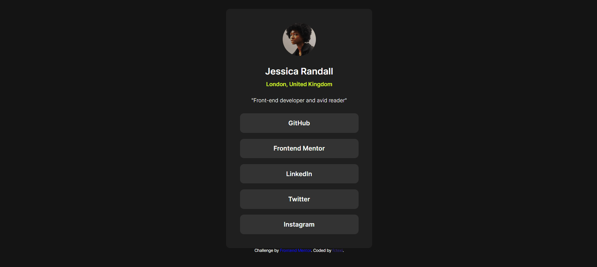

# Frontend Mentor - Social links profile solution

This is a solution to the [Social links profile challenge on Frontend Mentor](https://www.frontendmentor.io/challenges/social-links-profile-UG32l9m6dQ). Frontend Mentor challenges help you improve your coding skills by building realistic projects. 

## Overview

### The challenge

Users should be able to:

- See hover and focus states for all interactive elements on the page

### Objective Preview

### Build With

This the resources i used to complete this chalenge:

- Semantic HTML5 markup
- CSS custom properties
- Responsive.css

### What i learned

In this project, I learned how to build good and well-structured HTML code. Analyzing the objective and dividing the project into different parts was a great help in accomplishing the HTML code.

I also learned how to create various types of CSS such as reset.css, style.css, responsive.css, variables.css, and how to use FontAwesome icons.

### Screenshot of my Solution

### Links

- Solution URL: [Social links profile solution](https://fctexi.github.io/Social-links-profile/)